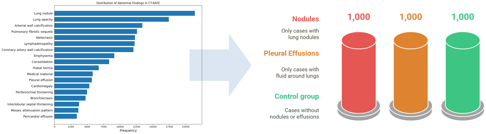
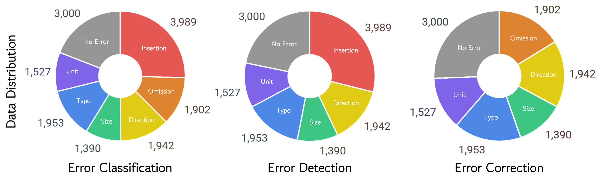
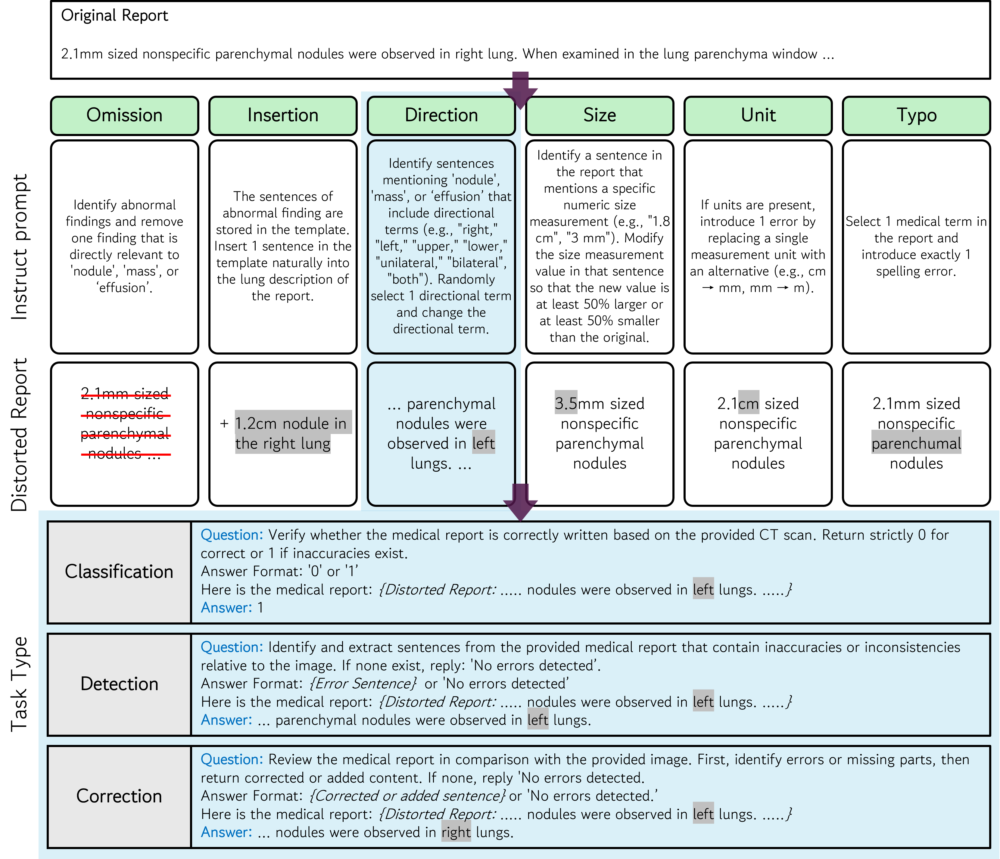

# MedErr-CT: A Visual Question Answering Benchmark for Identifying and Correcting Errors in CT Reports

<font size=3><div align='center' > **Paper** | [**Data**](#dataset-preparation) | [**Benchmark**](#benchmark-dataset) | [**Generation QA**](#generate-error-qa-set)</div></font>
<!-- <font size=3><div align='center' > <a href=https://arxiv.org/abs/2404.00578>**Paper**</a> | [**Data**](#dataset-preparation) | [**Benchmark**](#benchmark-dataset) | [**Generation QA**](#generate-error-qa-set)</div></font> -->

A benchmark to evaluate clinically practical competencies through error detection and correction.
- We developed a VQA dataset of six error categories including vision-centric errors based on CT imagings.
- We provide a multi-level evaluation framework that assesses model performance across three stages: error classification, detection, and correction.
- We perform a comprehensive evaluation of state-of-the-art 3D medical MLLMs through both quantitative and qualitative analyses.


## Dataset Preparation
We constructed a balanced benchmark using the public CT-RATE dataset, selecting 1,000 cases each of nodules, pleural effusions, and controls based on their clear diagnostic criteria and quantifiable features.

 Dataset  | Description | Download Link |
| ------------- | ------------- | ------------- |
| CT-RATE | The first large-scale public dataset providing paired 3D chest CT volumes and radiology reports. | [HuggingFace](https://huggingface.co/datasets/ibrahimhamamci/CT-RATE)|
| RadGenome-ChestCT | An extended dataset based on CT-RATE that supports multimodal learning by adding anatomical segmentation masks, region-based reports, and VQA pairs. | [HuggingFace](https://huggingface.co/datasets/RadGenome/RadGenome-ChestCT)|

<p align="center"></p>


## Benchmark Dataset
We constructed ~40,000 error-specific QA samples across 6 error types and 3 difficulty levels using DSPy and LLaMA-3.3, with iterative validation by radiologists. A stepwise evaluation benchmark with vision-centric (Insertion, Omission, Direction, Size) and lexical error (Typo, Unit) types to assess MLLMs' robustness, covering classification, detection, and correction tasks.

<p align="center"></p>


### Generate Error QA set
We can directly evaluate each task by running:

<p align="center"></p>

```python
python data_generation/error_generation_dspy.py \
--csv_path '' \
--save_path '' \
--start_idx '' \
--end_idx ''
```


## Citation
If our dataset or project are helpful to you, please consider citing:

<!-- ```BibTeX
@misc{bai2024m3d,
      title={M3D: Advancing 3D Medical Image Analysis with Multi-Modal Large Language Models}, 
      author={Fan Bai and Yuxin Du and Tiejun Huang and Max Q. -H. Meng and Bo Zhao},
      year={2024},
      eprint={2404.00578},
      archivePrefix={arXiv},
      primaryClass={cs.CV}
}
``` -->


## Acknowledgement
We appreciate open source projects including: 
[RadFM](https://github.com/chaoyi-wu/RadFM), 
[M3D](https://github.com/BAAI-DCAI/M3D),
[CT-CHAT](https://github.com/ibrahimethemhamamci/CT-CHAT),
[Med3DVLM](https://github.com/mirthai/med3dvlm),
[MedM-VL](https://github.com/MSIIP/MedM-VL)
